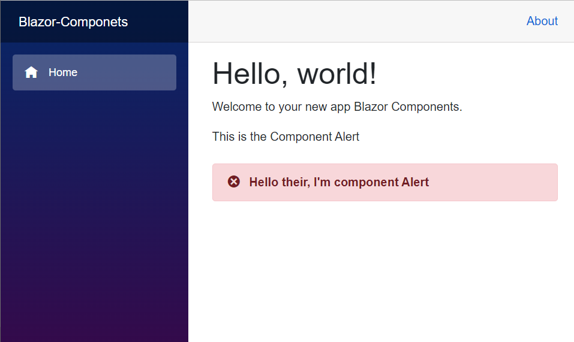

# Blazor Components

## Introduction
A component can be define a component as a small block or part of a page that has its own template, style, and properties. A Blazor app should have at least one component. A component can be a small button, a navigation bar, or a forum.

All rendered Blazor views descend from the ComponentBase class, This includes Layouts, Pages, and also Components.

As said before, a Blazor page is essentially a component with a @page directive that specifies the URL the browser must navigate to in order for it to be rendered. In fact, if we compare the generated code for a component and a page there is very little difference. 

## Routable and reusable components
Components in a Blazor application can be classified into two. Routable and shared (or reusable) components.

Components are usually kept in the Pages and Shared folder of the Client project.

## Routable components
The components kept in the Pages folder are Routable components. This means that you can associate these components with some specific routes or URLs.

If you take a look at the code of components in the Pages folder, you will see that the first line starts with an @page directive.

In the Index component, the page directive is set to /. This means that the component is the root component. Similarly, in the Counter component, the page directive is set to “/counter”. So, the counter component is accessible at https://localhost:port/counter.

## A new component
In this APP will be created a simple **Alert** component that will display the message passed throwout it. To create a component, Right-click on the Shared folder -> New Item – > Razor Component and name it Alert.razor.

```razor
<h3>Alert</h3>

@code {

}
```
The code will be something like this.
```razor
<div class="alert alert-danger mt-4" role="alert">
    <span class="oi oi-circle-x mr-2" aria-hidden="true"></span>
    <strong>@message</strong>
</div>

@code {
    [Parameter]
    public string message { get; set; }
}
```
above is the **Alert** component. to make the data binding between components it needs to create a variable with [Parameter] attribute. This marks the variable as a parameter that can be passed from any other components.

to use the component it only needs to input the tags with a component name.
```razor
<Alert message="Hello their, I'm component Alert"></Alert>

```
where the **message** will receive the message that it will display.

