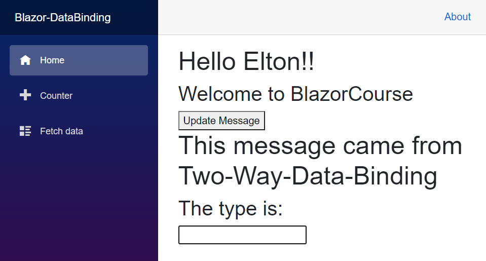
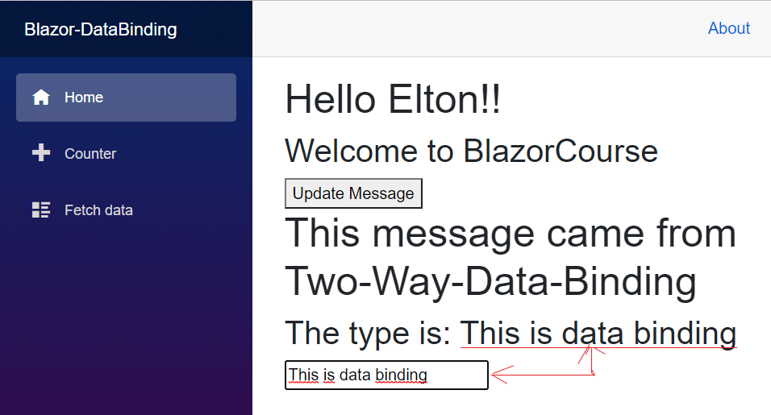

# Blazor Data Binding

## Introduction

Most web apps these days either display some sort of data on pages or they collect data from users using forms. This means every SPA framework must need to support data binding so that developers can bind data with elements such as labels, form controls, etc. Blazor components have built-in support of data binding and they support both one-way and two-way data binding using multiple techniques.

## One Way Binding
In one-way data binding, the data flows in one direction. The application code updates the value in response to some event or user action and when the value is updated, the corresponding UI is updated dynamically. In one-way data binding, the user is not allowed to change the value directly. In Blazor, we typically use @ symbol followed by the property, field, or even a method to implement one-way data binding. For example, if you have a Title property in your code and you want to bind it with an h1 element then you can write code similar to the following snippet.
```razor
	<h1>@message </h1>
```
Now to update the Title in the code you can use a simple button onclick event that can call a method UpdateTitle in the code to update the value of the Title property. As soon as, the user will click the button, the h1 element text will update automatically because the updated value will automatically flow from the code to the user interface.
```razor
	<button @onclick="updateMessage">Update Message</button>

@code{
    private string message { get; set; } = "Hello Elton!!";
 
    private void updateMessage()
    {
        message = "Hello, Elton, How are you???";
    }
}
```



## Two Way Binding
In two-way data binding data flows in both directions. Typically user updates the value in some form on the front-end and the value is automatically updated in the code at the back-end, then this updated value flows to UI and updates all elements bind to that value. In Blazor, two-way data binding can be achieved using the @bind attribute which can be used in several ways. The following simple example demonstrates the basic usage of the @bind attribute where we are using @bind=Property syntax to bind Title property with an input element.
```razor
	<h2>The type is: @readMessage</h2>
	<input @bind="@readMessage"/>

@code{
	private string readMessage { get; set; }
}
 ```
We can also bind a certain property to a specific event so that the property value only updates when that particular event occurs. The syntax of binding to a specific event is @bind:event=”EVENT NAME”. For example, in the following code snippet, I only want to change the Title property if the user moves the focus away from the input field.
```razor
	<h1>@FarFromHere</h1>

	<input @bind="FarFromHere" @bind:event="onchange" />

@code{
	public string FarFromHere { get; set; } = "Blazor";
}
 ```
