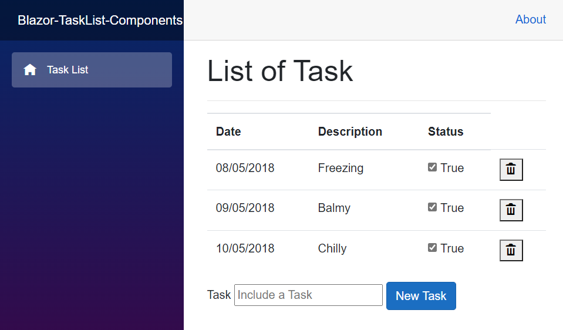
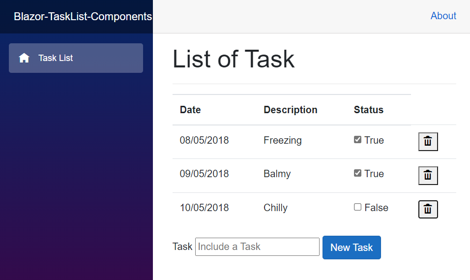

# Blazor Task List component

## Introduction
Continuing with the learning in components, this project is using the **Task List** project where a refactoring will be done in the code using Blazor's component techniques.

First things first, as the project is being developed in WebAssembly, a directory named **Entities** was created that will be responsible for allocating the class **TaskList**. and then the code was inserted into the class.
```razor
public class TaskList
{
	public Guid ID { get; set; }
	public string description { get; set; }
	public bool concluded { get; set; }
	public DateTime createDate { get; set; }
}
```
To make use of the **TaskList** class it is necessary to include it in **_imports.razor**, as shown below.
```razor
...
@using Blazor_TaskList_Components.Entities
```
after this inclusion, the **TaskList** class can be visible and accessed by any component of the project.

As our class is visible, in our page **Index.razor** it has some broken codes, to refactor the file, the following code was inserted.
```razor
	private List<TaskList> tasks = new List<TaskList>();

    protected override async Task OnInitializedAsync()
    {
        tasks = await Http.GetFromJsonAsync<List<TaskList>>("data/tasklist.json");
    }

    private List<TaskList> getTaskListed()
    {
        return tasks;
    }
```
one of the knowledge acquired so far, and the use of component, making use of this knowledge, a component named **Tasks** was created which contains the table presentation code.
```razor
<h1>Tasks List</h1>
<hr />

@if (tasks == null)
{
    <p><em>Loading...</em></p>
}
else
{
    <table class="table">
        <thead>
            <tr>
                <th>Date</th>
                <th>Description</th>
                <th>Status</th>
            </tr>
        </thead>
        <tbody>
            @foreach (var item in tasks)
            {
                <tr>
                    <td>@item.createDate.ToShortDateString()</td>
                    <td>@item.description</td>
                    <td>
                        <input type="checkbox" @bind="item.concluded" />
                        @item.concluded
                    </td>
                    <td>
                        <button @onclick="@(()=>removeTask(item.ID))">
                            <i class="hi hi-trash"></i>
                        </button>
                    </td>
                </tr>
            }
        </tbody>
    </table>
}
@if (tasks != null)
{
    <div class="form-group">
        <label>Task</label>
        <input type="Text" placeholder="Include a Task" @bind="newTaskList" />
        <button class="btn btn-primary" @onclick="includeNewTask">New Task</button>
    </div>
}
@code {

    private string newTaskList = "";

    void includeNewTask()
    {
        if (!string.IsNullOrWhiteSpace(newTaskList))
        {

            tasks.Add(new TaskList
            {
                createDate = DateTime.Now,
                description = newTaskList,
                ID = Guid.NewGuid()
            });

            newTaskList = "";

        }
    }

    private void removeTask(Guid id)
    {
        tasks.Remove(tasks.First(x => x.ID == id));
    }
}

```
this move makes it possible to use our component in other Blazor components.

this last move, caused the code to have errors, due to the lack of variable **tasks**, to solve the variable was created, and so that the *Data-Binding** can be done, the ** attribute was included Parameter** the variable.
```razor
@code{
	[Parameter]
	public List<TaskList> tasks { get; set; }
}
```

another refactoring that was made was the inclusion of the **Title** variable that will receive this value when calling the component.
```razor
<h1>@Title</h1>

@code{
	[Parameter]
	public string Title { get; set; }
}
```

after all the refactoring, and just call the new component inside the **Index.razor** component, as shown below.
```razor
<Tasks tasks="getTaskListed()" Title="List of Task"/>
```
as only refactorings were done, the result will still be the same.
 

Continuing with the code refactoring, another component called **IndividualTask** was created that will receive part of the **Tasks** component.
```razor
<td>@item.createDate.ToShortDateString()</td>
<td>@item.description</td>
<td>
	<input type="checkbox" @bind="item.concluded" />
	@item.concluded
</td>

@code {
	[Parameter]
	public TaskList item { get; set; }
}
``` 
Now, just call the new component inside the **Tasks.razor** component passing **item** as a parameter.
```razor
<IndividualTask item="item"/>
``` 


The result is still the same, however, with the refactoring, the program becomes more modular and easier to maintain. 