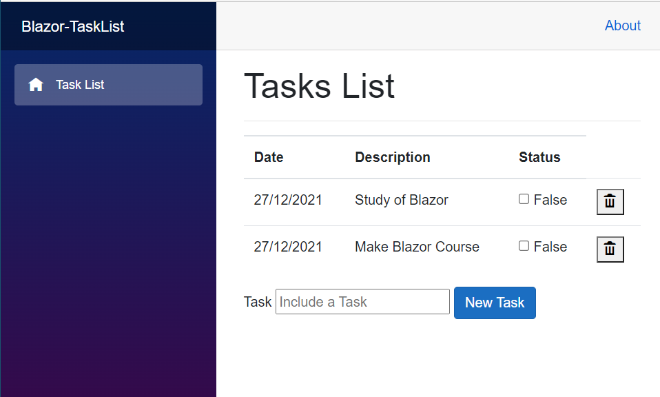

# Blazor-Tasklist App

## Introduction

This will be a simple program that will manage some tasks included by the user.
In this Git Page, you will find some annotation by myself about Blazor technology and C#.
I'm using these annotations to improve my knowledge in the C# and WebApplication.

## About TASK App

In the development, it will have:

The Class Task will have the variable to manipulate the data of the application.
```csharp
public class TaskList
{
    public Guid ID { get; set; }
    public string description { get; set; }
    public bool concluded { get; set; }
    public DateTime createDate { get; set; }
}
```
#### The Class Task
<li> <strong>Guid ID</strong> will be the Global Unic Identify, this will allows to generete a unic ID automaticaly;</li>
<li> <strong>description</strong> is the description of Tasks;</li>
<li> <strong>conclused</strong> will informe that the Task has been finished;</li>
<li> <strong>createDate</strong> will shows the date of tasks.</li>

------------
```csharp
private string newTaskList = "";
```
#### The Class Task
<li> <strong>newTaskList</strong> this variable will be the responsible to make the Two-Way-Binding to DOM and conclused the tasks.</li>

------------

```csharp
private List<Task> tasks = new List<Task>();
```
#### The Class Task
<li> <strong>tasks</strong> this List will content all task created by user.</li>

------------
#### Database tasks.Json

```json
[
  {
    "id": "0d4c9196-6d07-4fe5-959e-3ddaf0d32c89",
    "description": "Make Blazor Course",
    "concluded": "false",
    "createdate": "2021-12-26"
  },
  {
    "id": "9460add7-db1b-4fea-906e-d68cf3b7ecf4",
    "description": "Study of Blazor",
    "concluded": "false",
    "createdate": "2021-11-06"
  }
]
```

Also, it will have at wwwroot/data a tasks.Json that will have 2 tasks and will be load that every time the app is run it will be displayed.

This tasks.Json will allow the application to use the Dependency injection (DI) is a technique for accessing services configured in a central location: Framework-registered services can be injected directly into components of Blazor apps. Blazor apps define and register custom services and make them available throughout the app via DI.

After services are added to the service collection, inject the services into the components using the @inject Razor directive, which has two parameters:

Type: The type of service to inject.
Property: The name of the property receiving the injected app service. The property doesn't require manual creation. The compiler creates the property.
For more information, see Dependency injection into views in ASP.NET Core.

Use multiple @inject statements to inject different services.

```razor
@inject HttpClient http
```

To use @inject with the HTTPCLIENTE HTTP that will read the tasks.Json. after reading the file, using the @inject it will create a table after using 'foreach' to read all content in the JSON file.

#### Getting Data from tasks.Json
```csharp
protected override async Task OnInitializedAsync()
{
    tasks = await http.GetFromJsonAsync<List<TaskList>>("data/tasklist.json");

}
```
To Load the tasks it will use **OnInitializedAsync**. That method comes from Index.razor and is part of the component live cycle and run when the component is started 

------------

```razor
@if (tasks != null)
{
    <div class="form-group">
        <label>Task</label>
        <input type="Text" placeholder="Include a Task" @bind="newTaskList" />
        <button class="btn btn-primary" @onclick="includeNewTask">New Task</button>
    </div>
}
```
This piece of code above will verify if the Tasks is null and if not will create a table using **two-way data binding** with all content that comes from tasks.Json.

--------

```csharp
void includeNewTask()
{
	if(!string.IsNullOrWriteSpace(newTask))
	{
		task.Add(new Task
		{
			createDate = DateTime.Now,
			description = newTask,
			ID = Guid.NewGuid()
		});
		newTask="";
	}
}
```
The method **includeNewTask** will verify if the **newTask** is not null or empty and if not will include the task typed in a **newTask** with the description, the time, and the value of ID.

--------

```razor
@foreach(var item in tasks)
{
	<tr>
		<td>@item.createDate </td>
		<td>@item.description</td>
		<td>
			<input type="checkbox" @bind="item.concluded"/>
			@item.concluded
		</td>
	</tr>
}
```
after checking and updating the tasks.Json it will perform the **foreach** that will read all tasks in the tasks.Json and display them in the DOM.

--------
Also, after including and updating the data from tasks.json it will be possible either. 

```razor
<tr>
	<td>
		<button @onclick="@(()=>removeTask(item.ID))">
		<i class="oi oi-trash"><i/>
		</button>
	</td>
	<td>@item.createDate</td>
	<td>@item.description</td>
	<td>
		<input type="checkbox" @bind="item.concluded"/>
		@item.concluded
	</td>
</tr>
```
remove the item created.

```csharp
private void removeTask(Guid id)
{
	tasks.Remove(tasks.First(x => x.ID == id));
}
```
The function **removeTask** uses the Lambda test to find the first result with the ID passed as an argument it and remove it.

